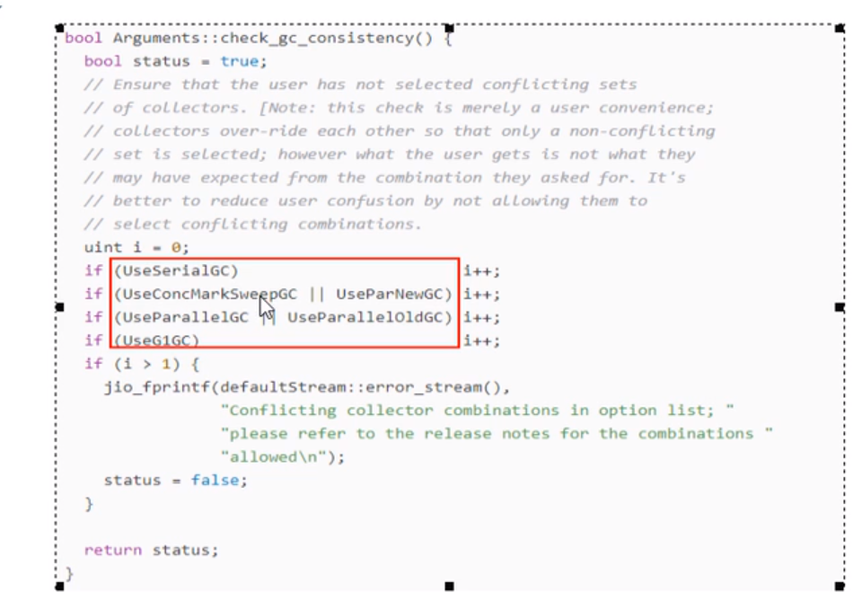
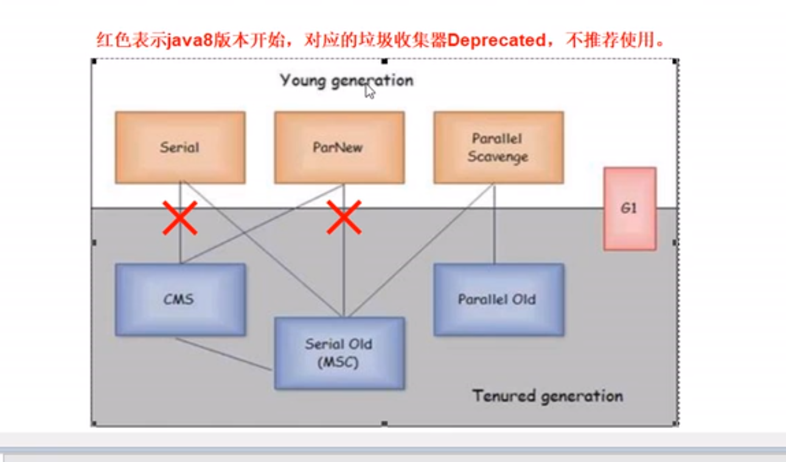

# JVM

## JVM 查看命令

* jinfo -flsgs 进程号 查看进程号的java信息
* java -XX:+PrintFlagsInitial
* java -XX:+PrintCommandLineFlags

## 字节码

* java编译后，针对变量，会在当前操作栈中，按顺序生成一个局部变量表，用于记录变量的位置，在后对变量进行操作时候，就是对变量的位置进行操作，位置就代表变量

  ``` java
  public class JavaPTest {
  
      public static void main(String[] args) {
          //【i】 在第一个位置，【k】在局部变量表中第【10】位，【t】在局部变量表中第【19】位
          int i = 10,a,b,c,d,e,f,j,h,k=0,l,m,n,o,p,q,r,s,t;
          i = i + 1;
          t = 1;
          t++;
          k++;
          System.out.println(t);
      }
  
  }
  ```

* javap -c 编译出来的字节码

  ```
  Compiled from "JavaPTest.java"
  public class cn.chpeng.study.jvm.JavaPTest {
    public cn.chpeng.study.jvm.JavaPTest();
      Code:
         0: aload_0
         1: invokespecial #1                  // Method java/lang/Object."<init>":()V
         4: return
  
    public static void main(java.lang.String[]);
      Code:
         0: bipush        10		//将一个8位带符号整数压入栈
         2: istore_1				//将int类型的值存入局部变量1
         3: iconst_0				//将int类型0压入栈
         4: istore        10		//将int类型存入局部变量10
         6: iload_1				//从局部变量1中装载int数据
         7: iconst_1				//将int类型1压入栈
         8: iadd					//执行整型加法操作
         9: istore_1				//将整型数据存入局部变量1
        10: iconst_1				//将整型1压入栈
        11: istore        19		//将整型存入局部变量19
        13: iinc          19, 1	//把一个常量值加到一个int类型的局部变量上（把局部变量位置是19的整型数据+1）
        16: iinc          10, 1	//把一个常量值加到一个int类型的局部变量上（把局部变量位置是10的整型数据+1）
        19: getstatic     #2                  // Field java/lang/System.out:Ljava/io/PrintStream;    // 从类中获取静态字段
        22: iload         19		//从局部变量19中装载int数据
        24: invokevirtual #3                  // Method java/io/PrintStream.println:(I)V  //调度对象的实例方法：invokevirtual
        27: return
  }
  
  ```

## JVM优化策略
* 尽量减少Full GC 的次数
  根据业务需要，进行分析，了解对象的特定，进行合理的设置，在java虚拟机中，年轻代和老年代的大小默认比是 1:2 ，eden : survivor0 : survivor1 = 8 : 1 : 1
+ 这个策略就是尽量减少GC的次数,就是说垃圾对象，尽量在MinGC中清除掉，也就是说，尽量减少垃圾对象进入老年代的存储空间
  + 对象进入老年代的的场景
  
  - 长期存活的对象(`-XX:MaxTenuringThreshold`)， 晋升年龄最大阈值，默认15。在新生代中对象存活次数(经过YGC的次数)后仍然存活，就会晋升到老年代。
  
  - 动态对象年龄判定（`-XX:TargetSurvivorRatio`）,对同一GC年龄的内存大小约survivor的比例 默认一半，即survivor区对象目标使用率为50%。
  
  - 对象大于`-XX:PretenureSizeThreshold` 配置的值，会直接进入老年代 
  + 所以优化策略就是
    根据老年到的场景，动态年龄判断对象，和大对象，是朝生夕死的对象，那就应该尽量不免进入老年代，因为进入老年代，需要FullGC才能被回收，尽量做到在MinGC的时候，进行回收，这样就可以减少Full Gc的次数从而提高系统性能，方式是 可以提高退年轻代的大小，从而减少这种对象进入老年代 
* 尽量减少GC时间
* 选择合适的垃圾处理器并发回收

## JVM 垃圾回收器

垃圾回收器一共分为7 中





### 1. 单线程收集器 

#### serial：

​	配置参数：`-XX:+UseSerialGC`,配置了这个参数，老年代自动选择是seriaOld收集器

​	是单线程年轻代垃圾回收器，使用的是复制算法

####  serialOld(已过时)

​	配置参数：`-XX:+UserSerialOldGC`,配置了这个参数，年轻代自配选择seria收集器

​	是单线程老年代的垃圾回收器

**Java HotSpot(TM) 64-Bit Server VM warning: Using the ParNew young collector with the Serial old collector is deprecated and will likely be removed in a future release**


### 2. 多线程的垃圾回收器

#### ParllelNew

​	配置参数：`-XX:+UseParNewGC` 老年代自动选择Serial Old收集器

​	是多线程年轻代垃圾回收器，使用的复制算法

#### prallel scavenge 

​	配置参数：`-XX:+UseParallelGC` 年老代自动选择Parallel Old收集器

​	是年轻代多线程的垃圾回收器使用的是复制算法，关注点是吞吐量

#### parallel old

​	配置参数：`-XX:+UseParallelOldGC`  使用这个参数，年轻代自动选择Parallel Scavenge 收集器

​	是老年代垃圾回收器，是用的是标记整理算法

### 3. CMS 垃圾回收器

配置参数： `-XX:+UseConcMarkSweepGC` ,年轻代自动算选择 ParllelNew 收集器

使用的是并发标记清除算法老年代回收器

1. 初始标记（stop-the-word）：从GCroot 进行可达性分析，标记垃圾数据
2. 并发标记：与用户线程并发执行
3. 重新标记（stw）:修正标记的错误
4. 并发清除：与用户线程并发执行，将垃圾数据进行删除

优点：

	1. 可以减少用户线程停顿时间

缺点：

​	1. 使用的是并发清除，容易产生内存碎片，有大对象过来时，容易提前产生full gc

### 4. G1 收集器

​	不区分年轻代和年老代，将堆内存分成大小相同的区域（region）,这个region的大小是1~32M，最多能分隔2048个块，最大支持内存是32m * 2048 = 64G 

​	G1模糊的年轻代与年老代的概念，每一个region都有可能存放年轻代对象，年老代对象，region的角色可以转换，如果存的对象是年轻代GC存活的对象，则保存的region是幸存区（survivor），如果使老年代GC后生存的对象，则region就是老年代。 老年代和年轻代内存并不是连续的

1. 初始标记（stop-the-word）：从GCroot 进行可达性分析，标记垃圾数据
2. 并发标记：与用户线程并发执行
3. 最终标记（stw）:修正标记的错误
4. 并发清除：与用户线程并发执行，将垃圾数据进行删除


