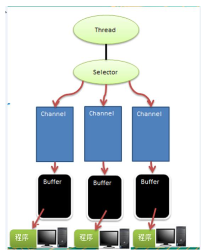
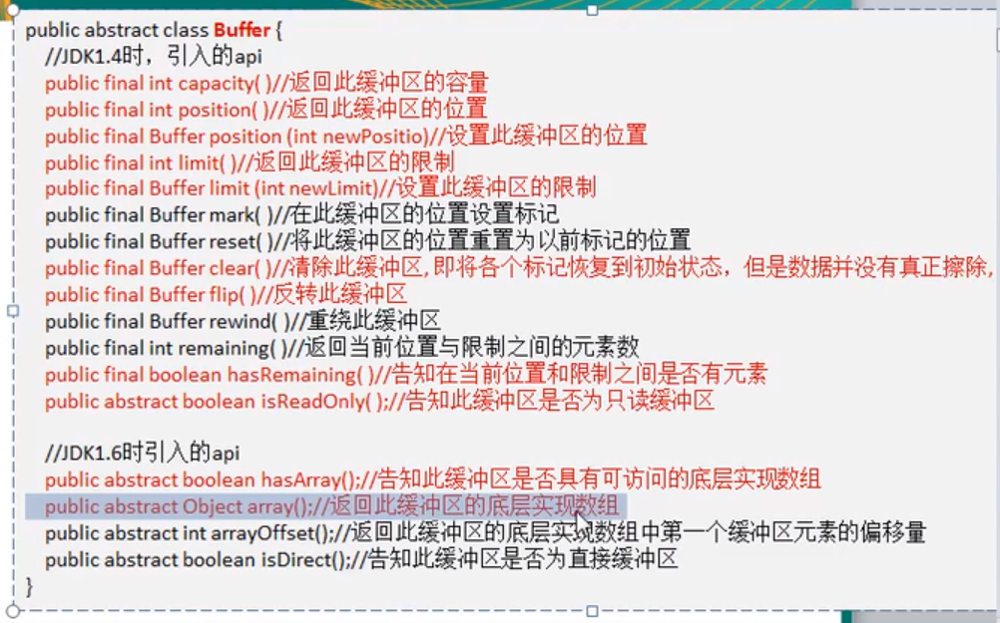
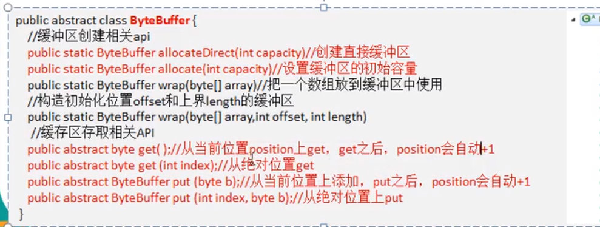

# NETTY

netty 是异步的基于事件驱动 Nio 框架


## BIO

阻塞io,一个线程与一个客户端相连，当客户端没有向服务器发送数据的时候，服务端线程需要等待，造成服务端资源的浪费


## NIO

同步非阻塞IO,原理是，客户端sockert,建立连接的时候，服务器不用再用单独的线程约客户端线程一一对应，而是服务器用一个/一组线程去维护 多路复用器，客户端，通过向多路复用器去注册相应的事件，服务器去循环channel列表，找到准备好的事件channel，进行相应的操作

同步：服务端线程在处理数据的对象的时候是同步的

非阻塞：当Buffer中没有数据的时候，这个服务端线程可以处理其他事情，并不需要在那等待客户端发送数据

* Channel 客户端与
* Buffer ：用于于Channel 用于与客户端进行数据对象的缓冲区，Channel和客户端连接  从 buffer中 read/write 数据，因为有的这个，才能是NIO是非阻塞的 
* Selector： 用于监听对个channel的事件

### Selector、channel、Buffer的关系



* 一个channel对应一个Buffer
* 对个Channel可以都注册在一个selector上
* 一个线程对用一个selector ，一个线程对应对个channel
* selector 通过注册的事件，在不同的channel中进行切换
* 数据读写是通过Buffer，读取的时候，需要调用buffer的flip() 将缓存转换成读的模式

## Buffer

Buffer是一个可读写的内存块，内部是数组实现的，通过 position limit capactity 这些熟悉进行读写


```java
private int mark = -1;//标记
private int position = 0;//下一个读写的指针
private int limit; //当前缓冲区的终点，不能对查过limit的位置进行读操作，可以设置limit
private int capacity; //容量初始化后，不可变的
```

常用方法：






``` java
  public static void main(String[] args) {
        IntBuffer intBuffer = IntBuffer.allocate(10);
        for(int i = 0;i<intBuffer.capacity();i++) {
            intBuffer.put(i);
        }
        //将buffer成可读的
        /**
         *         limit = position; 将position的值赋值给limit,也就是说，将写到哪的指针给limit，以后再读取的时候，不能超过limit
         *         position = 0; 表示，读取的时候，也是从这个position位置开始读取，flip以后，也就是设置成从0开始读取
         *         mark = -1;
         *         return this;
         */
        intBuffer.flip();
        //可以设置成从哪个位置读取数据
        intBuffer.position(2);
        //可以设置limit，表示最多读多少数据,程序运行结果是2,3,4
        intBuffer.limit(5);
        //hasRemaining比较的是  position < limit
        while (intBuffer.hasRemaining()) {
            System.out.println(intBuffer.get());
        }
    }
```


## Channel

1. 通道是可以双休读写的
2. 可以从缓冲区读数据，也可以缓冲区写数据
3. 可以异步读写数据
4. 可以读写的时候，在buffer数组中读取和写入
5. MappedByteBuffer 可以使用堆外内存


```java
  /**
   * 可以使用堆外内存，不用再应用层面进行复制，提高性能
   */
MappedByteBuffer map = channel.map(FileChannel.MapMode.READ_WRITE, 0, 30);

map.put(0, (byte) 'C');
map.put(2, (byte) 111);
map.put(5, (byte) 'P');
map.put(28, (byte) 'C');
map.put(26, (byte) 'D');
```