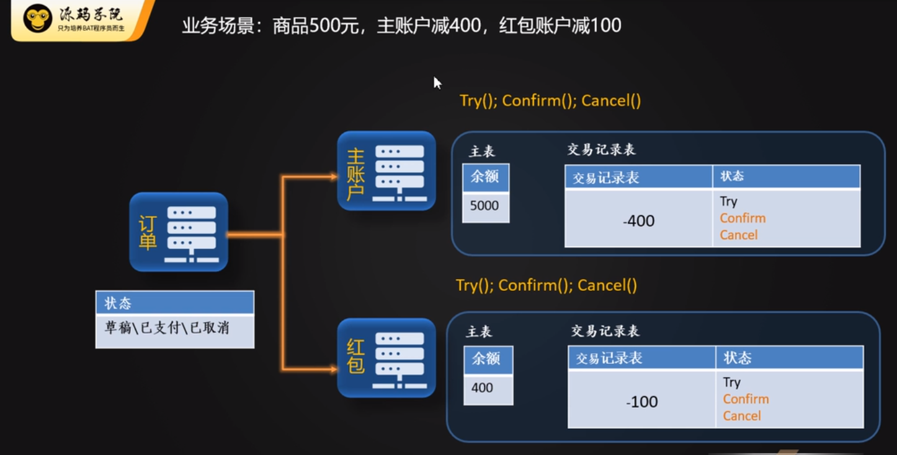

## 两阶段提交（2PC）

1. 事务协调者发起分布式事务
2. 每个事务参与者取执行本地事务，但不提交，并将执行状态反馈给事务系统调者（prepare）
3. 事务协调者通过每一个事务参与者执行状态的反馈
4. 如果多有的事务参与者都成功，则向事务参与者发起事务commit通知
5. 如果有事务参与者执行失败，则需要向其他事务参与者发起事务回滚

## CAP

一个分布式事务，最多能同事满足其中的两项

C ：强一致性

A ： 可用性

P : 分区容错性

## BASE理论

如果无法做到强一致性，可以采用一定的措施，做的最终一致性

1. 基本可用
2. 软状态
3. 最终一致性

## TCC 事务

* 是依赖业务系统，是在业务逻辑中实现分布式事务，是一个模式代码，和2PC有点类似
* Try： 尝试执行业务，在尝试阶段，记录操作日志，并将状态设置为try,回滚或提交的时候，判断这条日志状态
* Commit：确认执行业务
* Cancel：取消执行业务

