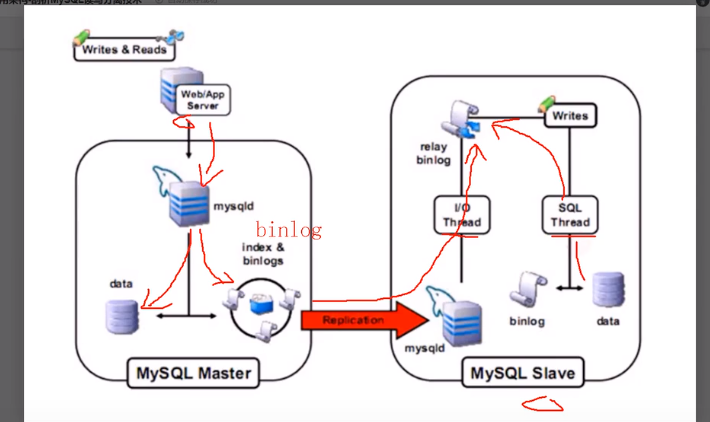
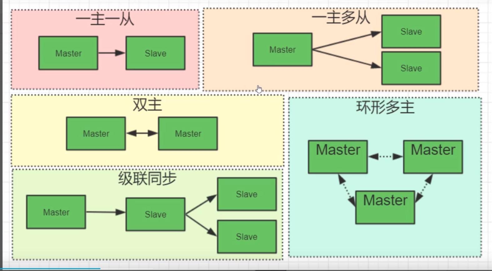

# 二叉树 

右边的元素 >左边的元素 ，如果所有的数据都是递增了，则就会退化成链表

# HASH

* 对索引字段进行hash，与数据的磁盘文件地址放在同一行，当查找的时候，通过hash可以快速查找数据磁盘文件地址，但是对范围查找支持不会好

# B-TREE(B树)

* 所有叶子节点具有相同的深度，叶子节点的指针为空
* 叶子节点的索引顺序，从左到右排列
* 多有的索引元素不重复

# B+-TREE（B+树）

* 非叶子节点不存储数据，只存储索引，可以存放更多的索引
* 叶子节点包含所有的字段
* 叶子节点之间用指针链接，用于范围查找

## B树与B+树的区别

* B+树非叶子节点，没有存储数据，B树非叶子节点存储了数据
* B+树叶子节点之间，用指针相连，B树没有相连

# MyIsAM 引擎

* .frm结尾 存储表的数据结构
* .myi结尾 存储索引数据
* .myd结尾 存储数据
* 索引类型使用B+树，叶子结点存储的是，数据的指针（MYD文件的位置指针），所以在查找的时候，会先查找MYI->MYD

  

# Innodb

* .frm文件结尾的就输数据结构
* .ibd文件是索引和数据
* 存储的数据也是B+树，数据会在叶子节点上，和MyIsAM不同，MyIsAm 数据是存在另一个文件中，索引的叶子节点只存储指针，Innodb 叶子节点就存储数据
* 如果指定索引，Innodab默认会自己创建一个索引（rawId），因为，这个Innodb就是通过B+树的结构保存数据的
* 推荐逐渐使用 整型自增的方式，比uuid 便于比较，且便于范围查询

  

# 聚集索引

* 叶子节点包含完整的数据（Innodb的逐渐索引就是聚集索引，MyIsAm主键的索引是非聚集索引

# Mysql主从（binlog -> relay binlog）

* binlog 只会存储 数据的增删改
* `show relaylog events;`  (Io Thread / Sql Thread )

